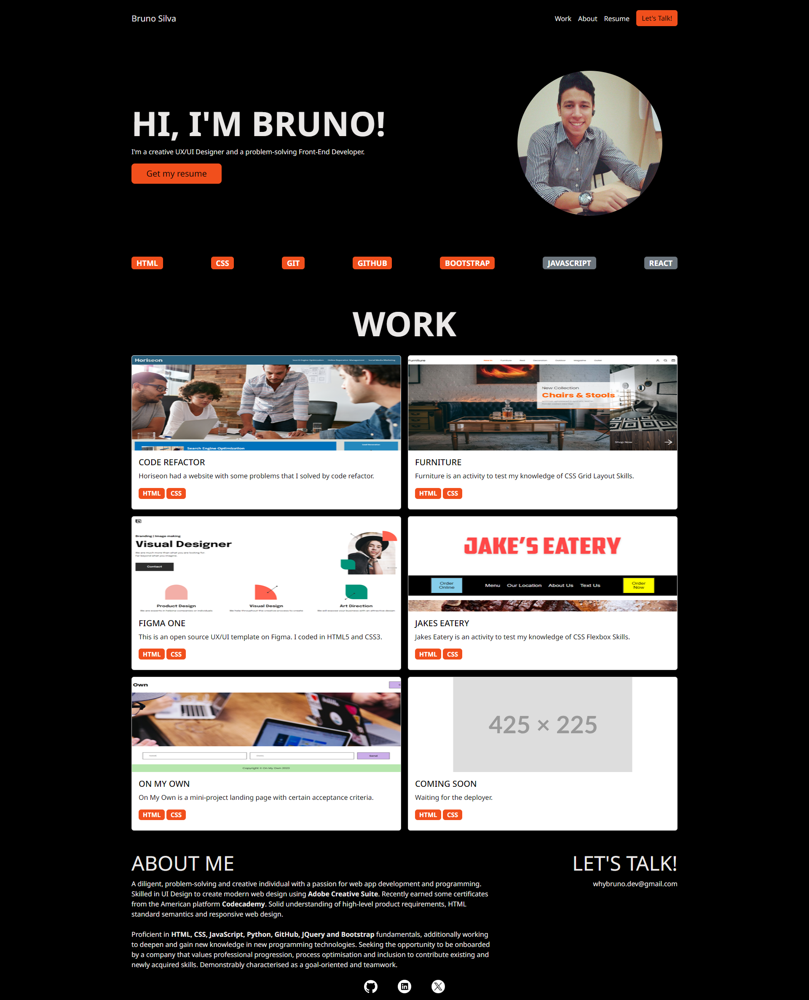

# :full_moon: About The Project

**Bootstrap-Portfolio**  is a new version of my old responsive Portfolio-of-Bruno, recreated in Bootstrap 5 for this week's challenge at the **edX Front-End Web Development Bootcamp**.

# :waxing_gibbous_moon: Features

- Bootstrap 5
- HTML Semantic
- HTML Responsive Web Design

# :first_quarter_moon: Screenshot

# :waxing_crescent_moon: Acceptance Criteria

- A navigation bar menu at the top.
- Use bootstrap cards for each project.
- An "About Me" section in the same row.
- A section displaying your work in grid.
- All hyperlinks should have a hover effect.
- Links should navigate to the appropriate sections.
- All buttons should display a box shadow upon hover.
- List out the skills you expect to learn from the bootcamp.
- A jumbotron featuring your picture, your name, and any other information.

# :new_moon: Technologies

- HTML
- CSS
- JAVASCRIPT
- BOOTSTRAP 5

# :globe_with_meridians: Website

- [Portfolio of Bruno](https://whybruno.github.io/bootstrap-portfolio)

# :copyright: Credits

N/A

# :registered: License

MIT License